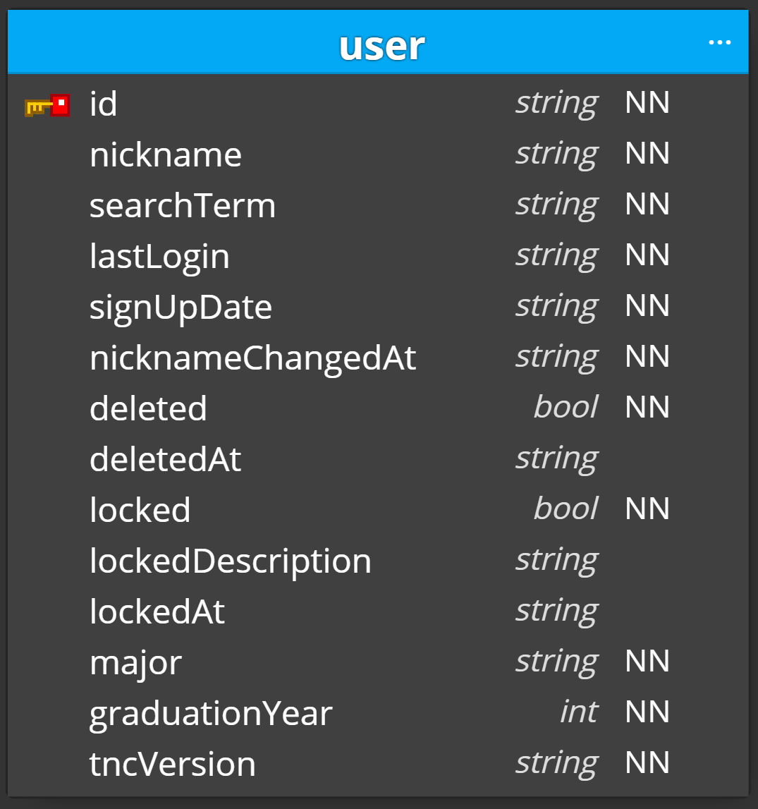

# Collegemate User API

Repository for Collegemate project's User API.

API Documentation is not yet published.
Other APIs and FE repository will be listed here later.

## Scripts

Here is the list for supported npm/yarn scripts. These are used to lint, test, build, and run the code.

- `lint`: lint the code
- `lint:fix`: lint the code and try auto-fix
- `build`: compile typescript codes (destination: `dist` directory)
- `clean`: remove the compiled code
- `start`: run the codes (Need following Environment Vairables: DB_ENDPOINT, DB_KEY, DB_ID)
- `test`: Run the codes

Use Azure Cosmos DB Emulator while testing the application.
Details on install and usage guide of the emulator can be found [here](https://docs.microsoft.com/en-us/azure/cosmos-db/local-emulator?tabs=ssl-netstd21).  
Microsoft also offers Emulator for Linux environment, but as it is preview, we recomment to run the emulator on Windows.
In this case, developers have to manually enable access on a local network.
Refer to the guide provided above.

As of now, Windows Worker of GitHub Action does not support Service Container.
Therefore, Azure Cosmos DB Emulator cannot run on the GitHub Action Worker.
So, automatic tests are disabled; Need manual test and code review for all features before pull request merge.

## Dependencies/Environment

Developed and tested with `Ubuntu 22.04.2 LTS` and `Node v18.16.0`.

To configure the typescript development environment easily, [gts](https://github.com/google/gts) has been used.
Based on the `gts` style rules, I modified some to enforce rules more strictly.
To see the modification, please check [`.eslintrc.json` file](https://github.com/hyecheol123/Collegemate-User-API/blob/main/.eslintrc.json).

This project uses [Azure Cosmos DB](https://docs.microsoft.com/en-us/azure/cosmos-db/introduction) (NoSQL API).

It is NoSQL Database without schema; The stored data will look like the Data Diagram located below.

Data Diagram  

  

  
Click to see configurations of each collection.

  *To be added*

[Express](https://expressjs.com/) is a web framework for node.js.
This project used it to develop and maintain APIs more conveniently.